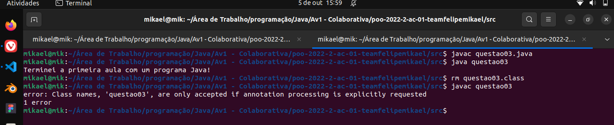
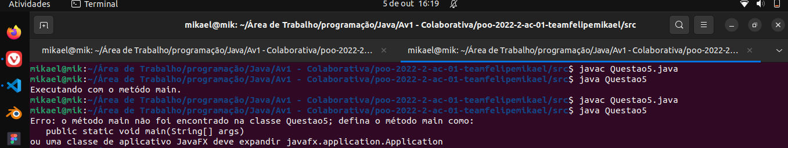
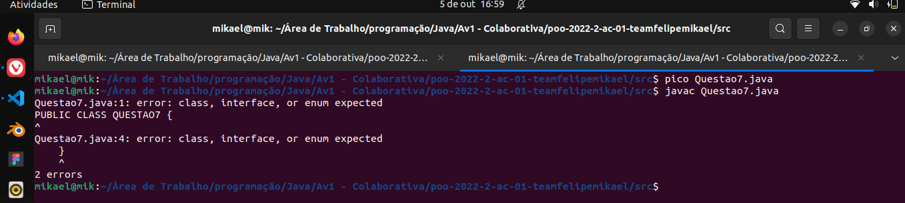
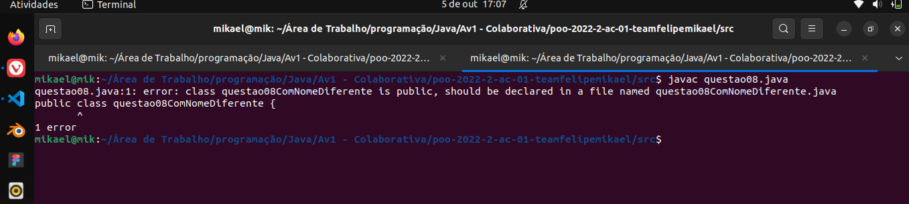

# Felipe & Mikael

---

## Questão 01: Explique qual a função da Máquina Virtual Java (JVM).
A JVM é responsável por interpretar o bytecode gerado pelo compilador. Isso torna a linguagem Java
multiplataforma, uma vez que o bytecode compilado é interpretado por uma máquina virtual, tendo
0 contato com o sistema operacional em si.

## Questão 02:
**JRE:** Ferramentas necessárias para a execução de aplicações Java (JVM e bibliotecas padrão);

**JDK:** Conjunto de ferramentas necessárias para desenvolver em Java.

## Questão 03:
Resposta no arquivo [src/questao03.java](src/questao03.java)

## Questão 04:
A JVM não conseguiu interpretar o código por não encontrar o bytecode gerado (arquivo .class)

## Questão 05:
A JVM não conseguiu interpretar o código, já que a classe não tem o método main.

Arquivo referente a questão: [src/Questao5.java](src/Questao5.java)

## Questão 06:
Resposta no arquivo [src/questao06.java](src/questao06.java)

## Questão 07:
Já que o Java é case sensitive, o compilador não conseguiu terminar o processo por conta dos erros de sintaxe.

Arquivo referente a questão: [src/Questao7.java](src/Questao7.java)

## Questão 08:
O código não pôde ser compilado por ser uma exigência da linguagem, que a classe do arquivo tenha o nome do arquivo.

Resposta no arquivo [src/questao08.java](src/questao08.java)

